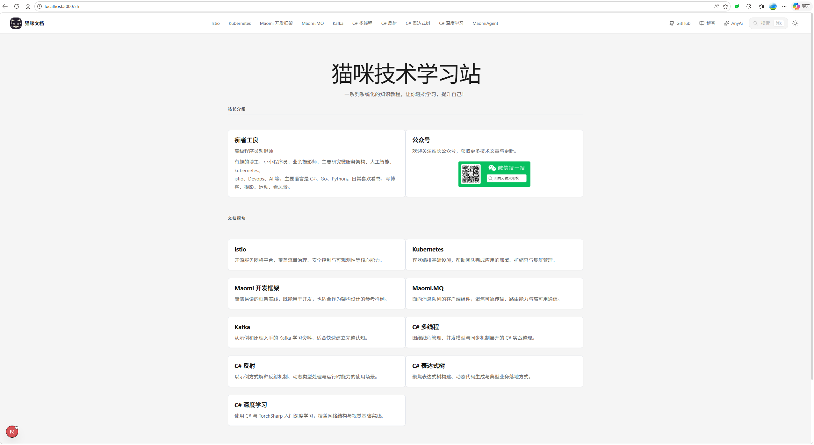
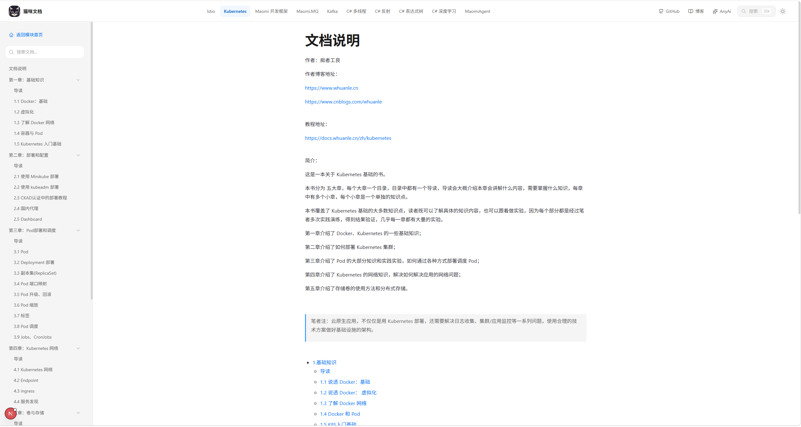
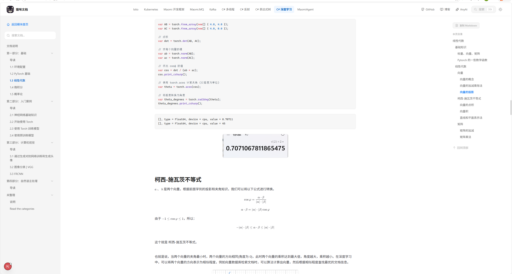

# 猫咪文档

猫咪文档是一个基于 Next.js 构建的文档站点镜像，运行时读取 `config/` 和 `docs/` 目录内容来生成可自定义的文档网站。适合通过 Docker 直接部署，并把站点配置、首页内容和文档内容与程序镜像分离维护。

## Docker 部署

- Docker Hub 镜像仓库：[https://hub.docker.com/r/whuanle/maomi-docs/tags](https://hub.docker.com/r/whuanle/maomi-docs/tags)
- 示例项目地址：[https://docs.whuanle.cn](https://docs.whuanle.cn)
- 默认镜像标签：`whuanle/maomi-docs:latest`

最常见的部署方式是同时挂载 `site.json` 和 `docs`。这样镜像可以保持固定，配置和文档由宿主机管理，无需因为文档更新而重新构建镜像。

Linux / macOS：

```bash
docker run --rm -p 3000:3000 \
  -v "$(pwd)/config:/app/config" \
  -v "$(pwd)/docs:/app/docs:ro" \
  whuanle/maomi-docs:latest
```


Windows PowerShell：

```powershell
docker run --rm -p 3000:3000 `
  -v "${PWD}\config:/app/config" `
  -v "${PWD}\docs:/app/docs:ro" `
  whuanle/maomi-docs:latest
```


启动后访问：

```text
http://localhost:3000
```

如果站点部署在 Nginx、Ingress、CDN 等反向代理后面，务必把原始协议和主机头透传给应用，否则页面里的图片请求可能会被防盗链误判为跨站请求，表现为“地址栏直接打开图片正常，但页面内 `` 返回 403”。

Nginx 示例：

```nginx
location / {
    proxy_pass http://127.0.0.1:3000;
    proxy_set_header Host $host;
    proxy_set_header X-Forwarded-Host $host;
    proxy_set_header X-Forwarded-Proto $scheme;
}
```

如果你确实需要允许其它站点引用文档图片，可以额外设置环境变量 `ALLOWED_HOTLINK_ORIGINS`，多个来源用逗号分隔，例如：

```bash
ALLOWED_HOTLINK_ORIGINS=https://www.whuanle.cn,https://anyai.wiki
```


## 使用方法

### 效果示例

自定义首页：



Markdown 渲染：





### 推荐目录结构

推荐把宿主机上的内容组织成下面这样，然后将 `config/` 和 `docs/` 挂载到容器内：

```text
your-doc-site/
├── config/
│   ├── site.json
│   ├── index.mdx
│   └── custom-head.html
└── docs/
    ├── map.json
    └── kubernetes/
        ├── README.md
        ├── map.json
        ├── 01.quick-start.md
        ├── 02.install.md
        └── advanced/
            ├── map.json
            ├── README.md
            └── 01.scheduler.md
```


容器运行时读取的路径是：

```text
/app/config/site.json
/app/docs
```


其中：

- `config/site.json` 控制站点标题、头部链接、页脚链接和备案信息
- `config/index.mdx` 可选，用于覆盖首页内容
- `config/custom-head.html` 可选，用于放统计代码或站点验证标签
- `docs/map.json` 控制模块列表
- 每个模块目录下的 `map.json` 控制左侧导航顺序和分组


### 站点配置 `config/site.json`

`config/site.json` 是站点的主配置文件。一个最小可用示例如下：

```json
{
  "title": "猫咪文档",
  "description": "探索技术文档和教程",
  "headerLinks": [
    {
      "label": "GitHub",
      "href": "https://github.com/whuanle",
      "icon": "github",
      "newTab": true
    }
  ],
  "footerLinks": [],
  "beian": {
    "icp": {
      "text": "粤ICP备18051778号",
      "href": "https://beian.miit.gov.cn/"
    },
    "police": {
      "text": "粤公网安备 44030902003257号",
      "href": "http://www.beian.gov.cn/portal/registerSystemInfo"
    }
  }
}
```


常用字段说明：

- `title`：站点名称
- `description`：站点描述，用于页面元信息
- `headerLinks`：顶部右侧链接
- `footerLinks`：底部链接
- `beian`：备案信息
- `customHeadHtml`：直接插入到页面 `<head>` 的 HTML 片段
- `customHeadHtmlFile`：外部 HTML 文件路径，适合存放统计代码和验证标签

其中 `headerLinks` 和 `footerLinks` 的每一项都支持：

- `label`：显示文字
- `href`：跳转地址
- `icon`：可选，支持 Lucide 图标名或图片路径，例如 `github`、`book-open`、`/icons/github.svg`
- `newTab`：可选，是否在新标签页打开


### 首页内容 `config/index.mdx`

如果你希望首页显示自定义内容，可以提供 `config/index.mdx`。只要这个文件存在，站点首页就会优先渲染它；如果没有提供，则回退到镜像内置首页。

适合放在首页里的内容通常包括：

- 项目简介
- 模块导航
- 更新记录
- 联系方式
- 外部链接


也就是说，首页内容完全是你自定义渲染的，mdx 格式支持 markdown 和自定义 html 标签，需要渲染出优美的首页。


### 文档模块入口 `docs/map.json`

根目录下的 `docs/map.json` 用来声明有哪些文档模块，以及它们在顶部导航中的顺序。示例：

```json
[
  {
    "directory": "kubernetes",
    "title": "Kubernetes",
    "order": 1
  },
  {
    "directory": "maomiagent",
    "title": "MaomiAgent",
    "order": 2
  }
]
```

字段说明：

- `directory`：模块目录名，必须和 `docs/` 下的实际文件夹一致
- `title`：顶部导航显示名称
- `order`：排序值，数字越小越靠前
- `description`：可选，预留的模块元信息
- `icon`：可选，预留的模块元信息


### 文档目录怎么放

每个模块都建议是一个独立目录，例如：

```text
docs/
├── map.json
└── kubernetes/
    ├── README.md
    ├── map.json
    ├── 01.quick-start.md
    ├── 02.install.md
    └── advanced/
        ├── map.json
        ├── README.md
        └── 01.scheduler.md
```


规则如下：

- 模块根目录建议放一个 `README.md`，访问 `/zh/<模块名>` 时会优先显示它
- 如果模块根目录没有 `README.md`，系统会回退到该模块 `map.json` 中的第一篇文档
- 子目录如果需要分章节，必须在子目录里再放一个 `map.json`
- 子目录里的 `README.md` 适合当成该章节的导读页，并在子目录 `map.json` 里排到第一位


### 模块导航 `docs/<module>/map.json`

模块目录下的 `map.json` 控制左侧导航的显示名称、顺序和分组。一个常见示例如下：

```json
[
  {
    "file": "README.md",
    "title": "导读",
    "order": 1
  },
  {
    "title": "入门",
    "order": 2,
    "children": [
      {
        "file": "01.quick-start.md",
        "title": "快速开始",
        "order": 1
      },
      {
        "file": "02.install.md",
        "title": "安装",
        "order": 2
      }
    ]
  },
  {
    "file": "advanced",
    "title": "进阶主题",
    "order": 3
  }
]
```


这里有两种组织方式：

- `file` 指向 `.md` 文件：表示一篇实际文档
- `children`：表示一个纯分组节点，可以把多个文件组织在同一组下面
- `file` 指向目录：表示一个物理子目录，这个目录里必须再提供自己的 `map.json`

如果某个 `file` 指向了目录，但目录里没有 `map.json`，该目录不会出现在导航中。


### Markdown 文档怎么写

当前最稳妥的写法是使用 `README.md` 和普通 `*.md` 文件。单篇文档可以这样写：

```md
---
title: 安装说明
updatedAt: 2026-05-17
---

# 安装说明

先阅读 [快速开始](01.quick-start.md)。


```

当前会生效的常用 Frontmatter：

- `title`：页面标题
- `updatedAt`：页面右上方更新时间

文档内容里的相对路径也会自动处理：

- 相对 Markdown 链接，例如 `[下一篇](02.install.md)`，会自动解析成站内路由
- 相对图片路径，例如 ``，会自动解析成当前文档目录下的静态资源


### 插入统计代码和验证标签

如果你需要添加 Google 统计、Microsoft Clarity 或 Google Search Console 验证标签，有两种方式。

方式一：直接在 `site.json` 中写 `customHeadHtml`。

```json
{
  "title": "猫咪文档",
  "description": "探索技术文档和教程",
  "customHeadHtml": "<meta name=\"google-site-verification\" content=\"your-code\" />\n<script type=\"text/javascript\">(function(c,l,a,r,i,t,y){c[a]=c[a]||function(){(c[a].q=c[a].q||[]).push(arguments)};t=l.createElement(r);t.async=1;t.src=\"https://www.clarity.ms/tag/\"+i;y=l.getElementsByTagName(r)[0];y.parentNode.insertBefore(t,y);})(window, document, \"clarity\", \"script\", \"your-clarity-id\");</script>"
}
```


方式二：把原始代码放到单独文件中，再由 `site.json` 引用。

`config/site.json`：

```json
{
  "title": "猫咪文档",
  "description": "探索技术文档和教程",
  "customHeadHtmlFile": "config/custom-head.html"
}
```

`config/custom-head.html`：

```html
<meta name="google-site-verification" content="your-code" />
<script type="text/javascript">
  (function(c,l,a,r,i,t,y){
    c[a]=c[a]||function(){(c[a].q=c[a].q||[]).push(arguments)};
    t=l.createElement(r);t.async=1;t.src="https://www.clarity.ms/tag/"+i;
    y=l.getElementsByTagName(r)[0];y.parentNode.insertBefore(t,y);
  })(window, document, "clarity", "script", "your-clarity-id");
</script>
```


如果同时配置了 `customHeadHtmlFile` 和 `customHeadHtml`，系统会先读取文件内容，再追加内联内容。

### 说明

- `Dockerfile` 使用 Next.js `standalone` 输出
- 镜像默认监听 `3000` 端口
- 镜像默认只内置应用代码、静态资源和 `config/`，不内置 `docs/`
- 示例中的 `:ro` 表示只读挂载，推荐保留


## 开发者

### 本地开发

安装依赖：

```bash
npm install
```

启动开发环境：

```bash
npm run dev
```

构建生产版本：

```bash
npm run build
npm run start
```

### 本地构建镜像

项目已提供根目录 `Dockerfile`，可以直接本地构建镜像：

```bash
docker build -t maomi-docs:latest .
```

### 推送到 Docker Hub

如果你需要手动构建并推送到 Docker Hub，可以使用根目录脚本：

```bash
./docker-publish.sh 0.0.3
```

默认镜像名是 `whuanle/maomi-docs`，脚本会依次执行：

```text
docker build -t whuanle/maomi-docs:latest .
docker tag whuanle/maomi-docs:latest whuanle/maomi-docs:0.0.3
docker push whuanle/maomi-docs:0.0.3
docker push whuanle/maomi-docs:latest
```

如果以后要改镜像名，可以额外传入第二个参数：

```bash
./docker-publish.sh 0.0.3 yourname/maomi-docs
```

如果你当前只方便用 PowerShell，也可以使用：

```powershell
.\docker-publish.ps1 -Version 0.0.3
```

### MCP 接入

站点提供一个标准 JSON-RPC 风格的 MCP 搜索端点：

```text
POST /mcp
```

当前提供的工具：

- `search_docs`：搜索文档内容，参数支持 `query`、`locale`、`limit`

最小初始化请求示例：

```bash
curl http://localhost:3000/mcp \
  -H "Content-Type: application/json" \
  -d '{"jsonrpc":"2.0","id":1,"method":"initialize","params":{"protocolVersion":"2025-06-18","capabilities":{},"clientInfo":{"name":"demo-client","version":"1.0.0"}}}'
```

列出工具：

```bash
curl http://localhost:3000/mcp \
  -H "Content-Type: application/json" \
  -d '{"jsonrpc":"2.0","id":2,"method":"tools/list","params":{}}'
```

调用搜索工具：

```bash
curl http://localhost:3000/mcp \
  -H "Content-Type: application/json" \
  -d '{"jsonrpc":"2.0","id":3,"method":"tools/call","params":{"name":"search_docs","arguments":{"query":"kafka consumer","locale":"zh","limit":5}}}'
```

如果 MCP 客户端支持远程 HTTP MCP，可以将服务地址配置为：

```text
http://your-host/mcp
```

### MCP 安全与限流

为了避免恶意流量和并发搜索把服务器拖垮，MCP 与搜索接口都加了服务端保护：

- 按客户端 IP 固定窗口限流
- 搜索任务全局并发上限
- 搜索索引内存缓存，减少反复扫盘
- 可选 Bearer Token 鉴权

支持的环境变量：

- `MCP_AUTH_TOKEN`：设置后，调用 `/mcp` 必须带 `Authorization: Bearer <token>`
- `MCP_RATE_LIMIT_WINDOW_MS`：MCP 限流窗口，默认 `60000`
- `MCP_RATE_LIMIT_MAX_REQUESTS`：每个 IP 在窗口内最大 MCP 请求数，默认 `30`
- `SEARCH_RATE_LIMIT_WINDOW_MS`：普通搜索接口限流窗口，默认 `60000`
- `SEARCH_RATE_LIMIT_MAX_REQUESTS`：每个 IP 在窗口内最大搜索请求数，默认 `90`
- `SEARCH_MAX_CONCURRENT_REQUESTS`：搜索最大并发数，默认 `4`
- `SEARCH_INDEX_TTL_MS`：搜索索引缓存时长，默认 `300000`

如果你要对公网开放，最低要求是同时设置：

- `MCP_AUTH_TOKEN`
- 反向代理层限流
- CDN 或 WAF
