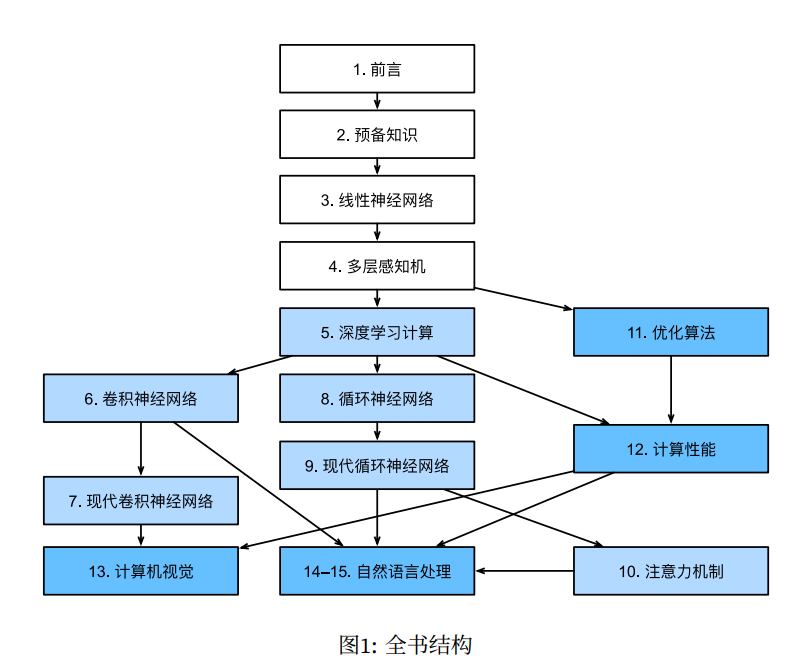
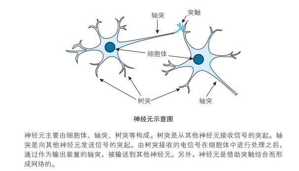
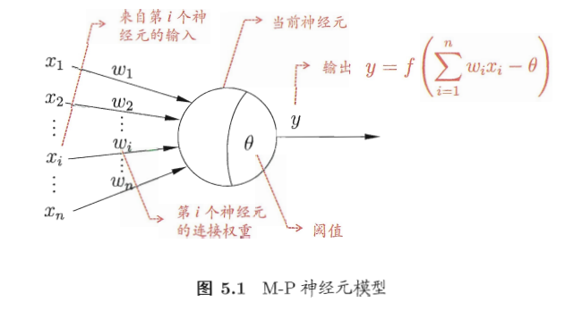
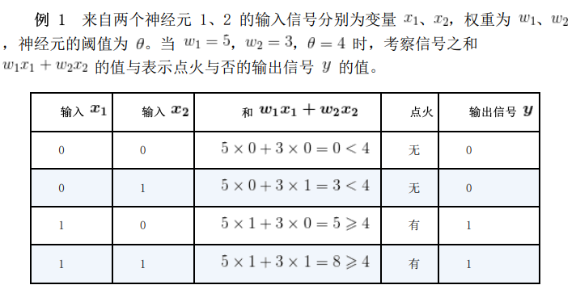
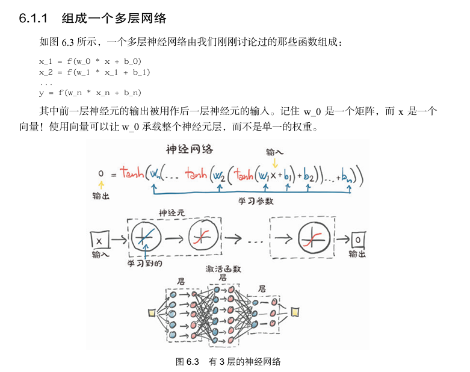
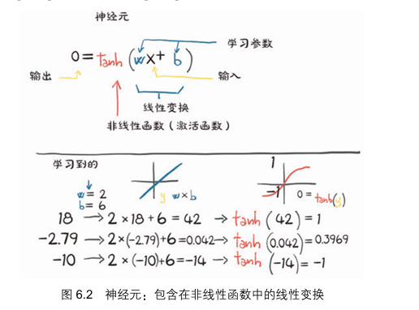
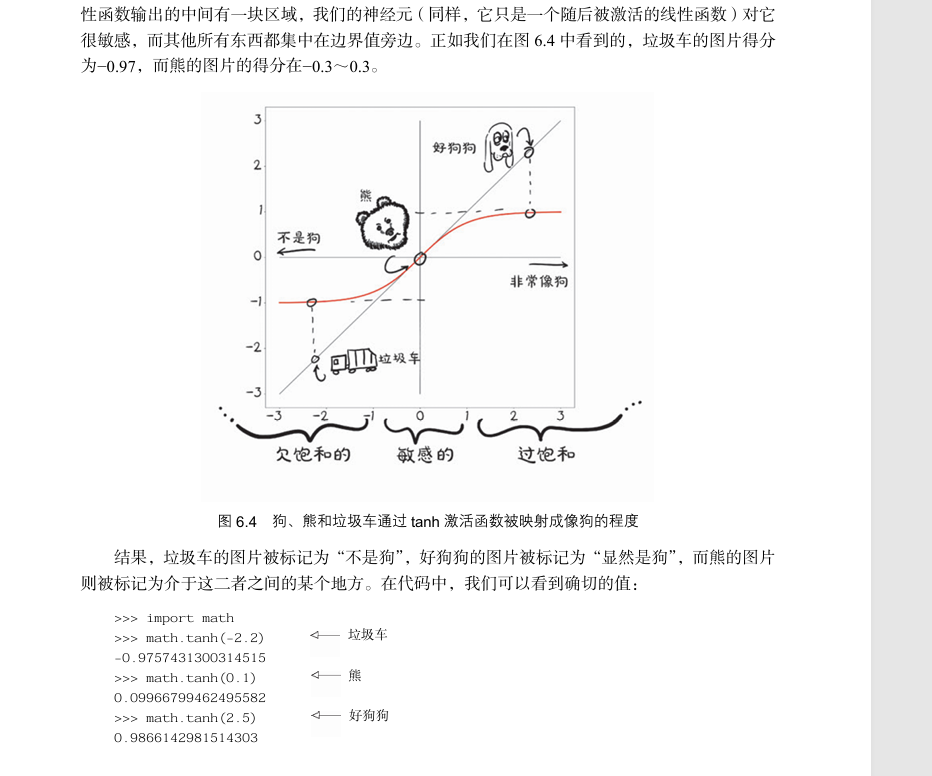

# 神经网络基础知识

在本章中，我们将来学习各种基础知识，连接神经网络的一些知识点，将数学和神经网络模型串联起来，为后面学习神经网络编程和模型训练打好基础。

由于神经网络涉及到很多数学知识和算法，而本书定位为入门级别的教程，加之笔者也是初学者，整个系列教程也是笔者边学边写的，因此这里不深入讲解复杂的细节，只是讲解一些知识到点，知道用来干嘛的就行。

本章的内容是笔者的笔记整理，知识不一定正确，想了解神经网络基础知识，建议读者参阅以下书籍：

* 《深度学习的数学》，作者：涌泉良幸；
* 非常推荐《深入浅出神经网络与深度学习》，作者： 迈克尔·尼尔森；
* 《动手学PyTorch建模与应用》，作者：王国平；
* 《PyTorch深度学习实战》，作者：[美] 伊莱•史蒂文斯；
* 《机器学习》，作者：周志华；

另外，笔者还推荐以下文章：

激活函数(Activation Function) -- 从线性转向非线性 https://zhuanlan.zhihu.com/p/656985797

为什么需要激活横竖？激活函数 https://blog.csdn.net/weixin_45751409/article/details/109851828

评估大模型显存 https://mp.weixin.qq.com/s/W_LiyC584qXLbwoxSBmnEg

模型格式和识别文件信息 https://juejin.cn/post/7408858126042726435

对于深度学习的路线，可以参考《动手深度学习-PyTorch(第二版)》李沐

在线版本：https://zh.d2l.ai/chapter_preface/index.html

https://zh-v2.d2l.ai/d2l-zh-pytorch.pdf

> 图来自：《动手深度学习-PyTorch(第二版)》

### 线性网络和多层感知机

神经网络是以神经元为基础的，这个跟生物上的神经元有所区别。下图是生物学上的神经元细胞图。

> 图来自 《深度学习的数学》。

 

神经元由细胞体、轴突、树突组成，神经元有多个轴突，单细胞体收到刺激后，会通过轴突把信号传递给其它神经元。神经元通过树突接收从其它神经元传递过来的信号。

把神经元通过轴突向其它神经元传递信号的动作称为点火，传递的信号只有 1 和 0，并且同时向所有轴突程度信号，也就是所有被轴突连接到的神经元都会收到通知。

那么，神经元什么时候会点火呢。

神经元是有阈值的，神经元有多个树突，从不同的神经元接收信号，只有当这些信号达到阈值时，才能刺激神经元。

比如说，神经元 A 的信号阈值是 $a$ 有三个树突，分别连接了 $x_{1}$ 、 $x_{2}$  、 $x_{3}$ 三个神经元，每个连接都有权重，那么：

$$
\omega{_{1}}{x_{1}} + \omega{_{2}}{x_{2}} + \omega{_{3}}{x_{3}} < \theta , y = 0\\
\omega{_{1}}{x_{1}} + \omega{_{2}}{x_{2}} + \omega{_{3}}{x_{3}} \ge \theta , y = 1\\
$$

 

看这个公式，如果把权重和神经元分开，相当于两个向量的内积。

 这种情况下，输出值只有 0，1，我们把这种模型称为线性模型，关于神经元的模型和公式有多个变种，这里就不细聊了。

如果使用矩阵乘法表示，也可以写成：
$$
[\omega{_{1}},\omega{_{2}},...,\omega{_{n}}] * [x_{1},x_{2},...,x_{n}] = \omega{_{1}}{x_{1}} + \omega{_{2}}{x_{2}} + ... + \omega{_{n}}{x_{n}}
$$

$$
y = \omega{_{1}}{x_{1}} + \omega{_{2}}{x_{2}} + ... + \omega{_{n}}{x_{n}} - \theta
$$

### 神经网络

对应一个神经网络来说，会由多个层组成：输入层、隐藏层、输出层。

比如说，如果我们要设置一个模型识别图片进行分类，一个简化的例子是以图片大小为 `28*28`，用二维数组表示的话，即784个像素值。不过一般我们把这28*28的二维数组转换为一层线性数据，即784个神经元。也就是说，输入层的大小就是 784。

在实际应用中，我们常常会对图片做预处理，比如缩放图片的大小至固定值，转换为黑白图片，再转换为线性数据方便神经网络处理。

### 多层感知机（MLP）

多层感知机由多个感知机组成，每个感知机层由多个神经元构成。多层感知机包括输入层、一个或多个隐藏层以及输出层。通过一层一层的输入、计算和输出，神经网络能够提取和组合数据中的特征，并进行预测。

### 激活函数

有一类函数叫单位阶跃函数，如果我们将前面的神经元输入输出函数修改为：

$$
\omega{_{1}}{x_{1}} + \omega{_{2}}{x_{2}} + \omega{_{3}}{x_{3}} - \theta < 0, y = 0\\
\omega{_{1}}{x_{1}} + \omega{_{2}}{x_{2}} + \omega{_{3}}{x_{3}} - \theta \ge 0 , y = 1\\
$$

我们设 $z = \omega{_{1}}{x_{1}} + \omega{_{2}}{x_{2}} + \omega{_{3}}{x_{3}} - \theta$  ， 上面的关系为 $u$ ，则：
$$
y = u(z) = \left\{
\begin{aligned}
0 \quad (z < 0) \\
1 \quad (z \ge 0)
\end{aligned}
\right.
$$

尽管单位阶跃函数很直观，但在深度学习中，通常使用其它的激活函数来引入非线性。

当然，在深度学习中，输出并不是只有 0 和 1，如果我们把 $u$ 替换为其它函数，那么：
$$
y = a(z) = a(\omega{_{1}}{x_{1}} + \omega{_{2}}{x_{2}} + \omega{_{3}}{x_{3}} - \theta)
$$
在数学上一般使用 $b$ 来表示 $-\theta$， $b$ 称为偏置。

所以：
$$
y = a(z) = a(\omega{_{1}}{x_{1}} + \omega{_{2}}{x_{2}} + \omega{_{3}}{x_{3}} + b)
$$

这里的函数 $a$ 被称为激活函数。

常见的激活函数包括：

**Sigmoid 激活函数** ：输出值在 0 到 1 之间，常用于二分类问题。但在高值或低值区域会有梯度消失的问题。

**Tanh（双曲正切）激活函数** ：输出值在 -1到 1 之间，相对于 Sigmoid 函数，tanh 函数收敛时的 0 均值特性更好，但同样存在梯度消失问题。

**ReLU（Rectified Linear Unit）激活函数** ：输出值为输入和 0 的较大值，计算简单且有效，能够减轻梯度消失问题

**Leaky ReLU 激活函数** ：是 ReLU 的变种，对于输入为负的小范围值允许小的梯度通过，从而减少“神经元死亡”风险。

**ELU（Exponential Linear Unit）激活函数** ：改善了 ReLU 的负输入问题，输出范围包括负值。

**Softmax 激活函数** ：一般用于多分类问题的输出层，将输入向量转化为概率分布，使得输出值之和为 1。

**Swish 激活函数** ：被 Google 研究提出，兼有 ReLU 的非负特性和 Sigmoid 的平滑特性，被认为在一些情况下效果优于 ReLU 。

### 神经网络的训练步骤

### 网络的定义

多层神经网络是怎么逐步传递的

单位阶跃函数。

### 神经网络分层

#### 输入层

#### 隐藏层

神经网络的权重的偏置。

#### 输出层

感知机和多层网络

#### 最优化

代价函数

优化器

### 向前传播、向后传播

前向传播（forward）和反向传播（backward）

参考 https://zhuanlan.zhihu.com/p/447113449

### 神经网络分类

卷积神经网络、循环神经网络、前馈神经网络。

### 卷积神经网络经典模型架构简介

GoogleNet 等模型
