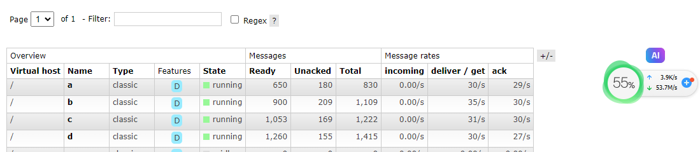
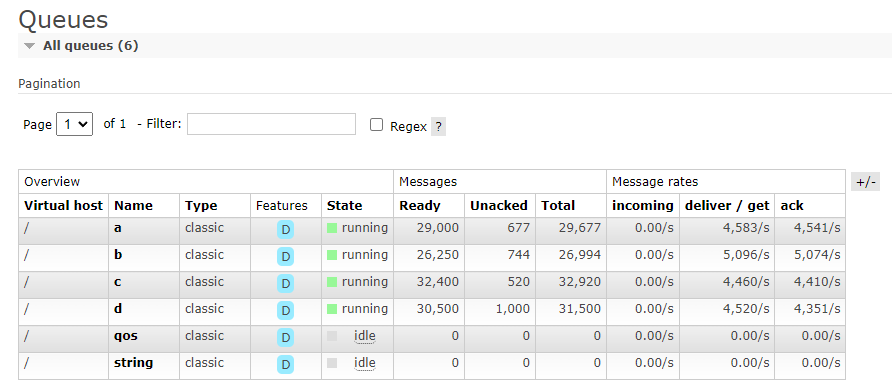
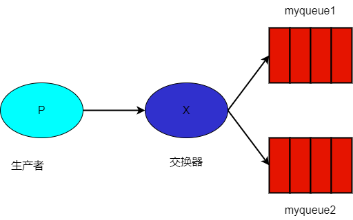
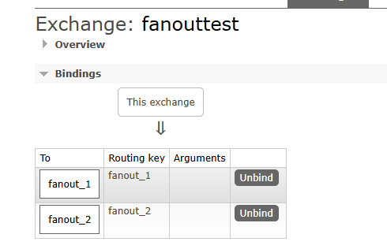

# 消费者

Maomi.MQ 的消费者很灵活，可以随时扩展出不同的工作模式，本身已经支持了普通消费者、事件总线编排、MediatR、FastEndpoints 等工作模式，能够以简单、灵活、方便的方式实现 RabbitMQ 消费。

因为 RabbitMQ 是交换器-路由键-队列三级模式，发布者只需要推送消息到交换器，而且交换器、路由键、队列的绑关系是由创建队列时配置的，所以 Maomi.MQ 简化了发布者模式，将主要配置都集中在消费者这里，通过消费者配置初始化路由、队列、消费逻辑等，对于死信队列、Qos 并发配置、广播模式等都需要在队列这里设置。

IConsumerOptions 是所有消费模式的配置抽象，其字段和功能说明如下。

```csharp
// Consumer.
// 消费者配置.
public interface IConsumerOptions
{
    // Queue name.
    // 队列名称.
    string Queue { get; }

    // Bind the death message exchange.
    // 绑定死信交换器.
    string? DeadExchange { get; }

    // Bind the death message queue.
    // 绑定死信队列.
    string? DeadRoutingKey { get; }

    // Queue message expiration time, in millimeters.
    // 队列消息过期时间，单位毫秒.
    int Expiration { get; }

    // Qos,1-65535，缓冲大小.
    ushort Qos { get; }

    // Whether to return to the queue when the number of consumption failures reaches the condition.
    // 消费失败次数达到条件时，是否放回队列.
    bool RetryFaildRequeue { get; }

    // Create queues on startup,<see cref="RabbitMQ.Client.IChannel.QueueDeclareAsync"/>.
    // 是否自动创建队列.
    AutoQueueDeclare AutoQueueDeclare { get; }

    // Bind the exchange.
    // 绑定交换器.
    string? BindExchange { get; }

    // Exchange type.
    // 交换器类型.
    ExchangeType ExchangeType { get; }

    // Bind the routing key.
    // 绑定路由键.
    string? RoutingKey { get; }

    // Broadcast mode.
    // 广播模式.
    bool IsBroadcast { get; }
}
```


下面举例简单讲解内置的一些消费者模式，这些模式在后面的章节会单独详细说明。


### 普通消费者模式

消费者服务需要实现 `IConsumer<TMessage>` 接口，并且配置 `[Consumer("queue")]` 特性绑定队列名称，通过消费者对象来控制消费行为，消费者模式有具有失败通知和补偿能力，使用上也比较简单。


```csharp
public class TestEvent
{
    public int Id { get; set; }
}

[Consumer("PublisherWeb", Qos = 1, RetryFaildRequeue = true)]
public class MyConsumer : IConsumer<TestEvent>
{
    private static int _retryCount = 0;

    // 消费
    public async Task ExecuteAsync(MessageHeader messageHeader, TestEvent message)
    {
        _retryCount++;
        Console.WriteLine($"执行次数:{_retryCount} 事件 id: {message.Id} {DateTime.Now}");
        await Task.CompletedTask;
    }

    // 每次消费失败时执行
    public Task FaildAsync(MessageHeader messageHeader, Exception ex, int retryCount, TestEvent message)
        => Task.CompletedTask;

    // 补偿
    public Task<ConsumerState> FallbackAsync(MessageHeader messageHeader, TestEvent? message, Exception? ex)
        => Task.FromResult(ConsumerState.Ack);
}
```

<br />

所有消费模式，都带有 ExecuteAsync、FaildAsync、FallbackAsync 三个函数，这三个函数决定了消费行为和错误处理逻辑。

```csharp
public interface IConsumer<TMessage>
    where TMessage : class
{
    // 当消息被正确反序列化后，处理接收到的消息
    // The received message is processed when it has been deserialized correctly.
    public Task ExecuteAsync(MessageHeader messageHeader, TMessage message);

    // 当 ExecuteAsync 出现异常后，立即执行
    public Task FaildAsync(MessageHeader messageHeader, Exception ex, int retryCount, TMessage message);

    // 当所有重试均失败，或出现不能进入 ExecuteAsync 方法的异常
    // When all retries fail, or an exception occurs that the ExecuteAsync method cannot be accessed.
    public Task<ConsumerState> FallbackAsync(MessageHeader messageHeader, TMessage? message, Exception? ex);
}
```


### 事件模式

事件模式是可以编排事件执行顺序的，需要实现 `IEventMiddleware<TMessage>`、`IEventHandler<TMessage>` 两个接口。

事件模式下，一个模型类不能被不同的事件使用，模型类即事件，一个事件一个模型。

```csharp
public class TestEvent
{
	public string Message { get; set; }
}
```

<br />

``IEventHandler<TMessage>` 是事件的入口，你可以在里面控制整体的执行和错误处理，使用 `await next(@event, CancellationToken.None);` 开始链式执行事件。

```csharp
public class TestEventMiddleware : IEventMiddleware<TestEvent>
{
    private readonly BloggingContext _bloggingContext;

    public TestEventMiddleware(BloggingContext bloggingContext)
    {
        _bloggingContext = bloggingContext;
    }

    public async Task ExecuteAsync(MessageHeader messageHeader, TMessage message, EventHandlerDelegate<TMessage> next)
    {
        using (var transaction = _bloggingContext.Database.BeginTransaction())
        {
            await next(@event, CancellationToken.None);
            await transaction.CommitAsync();
        }
    }

    public Task FaildAsync(MessageHeader messageHeader, Exception ex, int retryCount, TMessage? message)
    {
        return Task.CompletedTask;
    }

    public Task<ConsumerState> FallbackAsync(MessageHeader messageHeader, TMessage? message, Exception? ex)
    {
        return Task.FromResult(true);
    }
}
```

<br />


然后使用 `[EventOrder]` 特性编排事件执行顺序。

```csharp
// 编排事件消费顺序
[EventOrder(0)]
public class My1EventEventHandler : IEventHandler<TestEvent>
{
	public async Task CancelAsync(TestEvent @event, CancellationToken cancellationToken)
	{
	}

	public async Task ExecuteAsync(TestEvent @event, CancellationToken cancellationToken)
	{
		Console.WriteLine($"{@event.Id},事件 1 已被执行");
	}
}

[EventOrder(1)]
public class My2EventEventHandler : IEventHandler<TestEvent>
{
	public async Task CancelAsync(TestEvent @event, CancellationToken cancellationToken)
	{
	}

	public async Task ExecuteAsync(TestEvent @event, CancellationToken cancellationToken)
	{
		Console.WriteLine($"{@event.Id},事件 2 已被执行");
	}
}
```

<br />

消费者模式和事件总线模式都可以应对大容量的消息，如下图所示，每个消息接近 500kb，多个队列并发拉取消费。



<br />

如果消息内容不大，则可以达到很高的消费速度。



### 动态消费者

动态消费者可以在运行期间动态订阅队列，并且支持消费者类型、事件总线类型、函数绑定三种方式

注入 IDynamicConsumer 即可使用动态消费者服务。

```csharp
await _dynamicConsumer.ConsumerAsync<MyConsumer, TestEvent>(new ConsumerOptions("myqueue")
{
	Qos = 10
});
```

```csharp
// 自动事件模型对应消费者
await _dynamicConsumer.ConsumerAsync<TestEvent>(new ConsumerOptions("myqueue")
{
	Qos = 10
});
```

```csharp
// 函数方式消费
_dynamicConsumer.ConsumerAsync<TestEvent>(new ConsumerOptions("myqueue")
{
	Qos = 10
}, async (header, message) =>
{
	Console.WriteLine($"事件 id: {message.Id} {DateTime.Now}");
	await Task.CompletedTask;
});
```


### 消费者注册模式

Maomi.MQ 提供了 ITypeFilter 接口，开发者可以使用该接口实现自定义消费者注册模式。

Maomi.MQ 内置三个 ITypeFilter，分别是：

* 消费者模式 ConsumerTypeFilter
* 事件总线模式 EventBusTypeFilter
* 自定义消费者模式 ConsumerTypeFilter


框架还带有 MediatR、FastEndpoints 的扩展能力，也是通过自定义的 ITypeFilter 接入的，感兴趣的读者可以自行实现其它消费模式。

<br />

框架默认注册 ConsumerTypeFilter、EventBusTypeFilter 两种模式，开发者可以自行调整决定使用哪种模式。

```csharp
var consumerTypeFilter = new ConsumerTypeFilter();
// ...
builder.Services.AddMaomiMQ((MqOptionsBuilder options) =>
{
    // ... ...
}, 
[typeof(Program).Assembly], 	// 要自动扫描的程序集
[new ConsumerTypeFilter(), new EventBusTypeFilter(), consumerTypeFilter]); 	// 配置要使用的消费者注册模式
```


### 广播模式

在广播模式下，每个消费者线程都会收到相同的消息，例如在 Kubernetes 中，一个服务被创建了 10 个实例，那么每个实例都会同样收到消息，服务实例启动或注销时，会自动关联和注销绑定消息队列，所以实例即使下线也不会导致服务器消息堆积。

举个场景，有个核心服务处于集群入口，为了提高并发能力，做了 数据库-Redis-内存缓存三级机制，但是内存缓存是在每个实例中的，需要有一种机制能够通知服务实例更新缓存，那么这个广播模式刚刚好，每个实例都可以收到消息。

在广播模式下，发送者方无需做任何处理，消费者只需要在特性注解加上 `IsBroadcast = true` 即可。

```csharp
[Consumer("scenario.quickstart",IsBroadcast = true)]
```


### 多队列绑定

广播模式是用于将一条消息推送到交换器，然后绑定的多个队列都可以收到相同的消息，简单来说该模式是向交换器推送消息，然后交换器将消息转发到各个绑定的队列中，这样一来不同队列的消费者可以同时收到消息。




但是不同的交换器模式使用上不一样，下面笔者 fanout 为例，当队列绑定到 fanout 类型的交换器后，Rabbit broker 会忽略 RoutingKey，将消息推送到所有绑定的队列中。

所以我们定义两个消费者，绑定到一个相同的 fanout 类型的交换器：

```csharp
[Consumer("fanout_1", BindExchange = "fanouttest", ExchangeType = ExchangeType.Fanout)]
public class FanoutEvent_1_Consumer : IConsumer<FanoutEvent>
{
    // 消费
    public virtual async Task ExecuteAsync(MessageHeader messageHeader, FanoutEvent message)
    {
        Console.WriteLine($"【fanout_1】，事件 id: {message.Id} {DateTime.Now}");
        await Task.CompletedTask;
    }
    
    // ... ...
}

[Consumer("fanout_2", BindExchange = "fanouttest", ExchangeType = "fanout")]
public class FanoutEvent_2_Consumer : IConsumer<FanoutEvent>
{
    // 消费
    public virtual async Task ExecuteAsync(MessageHeader messageHeader, FanoutEvent message)
    {
        Console.WriteLine($"【fanout_2】，事件 id: {message.Id} {DateTime.Now}");
        await Task.CompletedTask;
    }
    
    // ... ...
}
```



<br />发布消息时，只需要配置交换器名称即可，两个消费者服务都会同时收到消息：

```csharp
[HttpGet("publish_fanout")]
public async Task<string> Publisher_Fanout()
{
	for (var i = 0; i < 5; i++)
	{
		await _messagePublisher.PublishAsync(exchange: "fanouttest", routingKey: string.Empty, message: new FanoutEvent
		{
			Id = 666
		});
	}

	return "ok";
}
```

<br />

对于 Topic 类型的交换器和队列，使用方式也是一致的，定义两个消费者：

```csharp
[Consumer("red.yellow.#", BindExchange = "topictest", ExchangeType = ExchangeType.Topic)]
public class TopicEvent_1_Consumer : IConsumer<TopicEvent>
{
    // 消费
    public virtual async Task ExecuteAsync(MessageHeader messageHeader, TopicEvent message)
    {
        Console.WriteLine($"【red.yellow.#】，事件 id: {message.Id} {DateTime.Now}");
        await Task.CompletedTask;
    }
    
    // ... ...
}

[Consumer("red.#", BindExchange = "topictest", ExchangeType = ExchangeType.Topic)]
public class TopicEvent_2_Consumer : IConsumer<TopicEvent>
{
    // 消费
    public virtual async Task ExecuteAsync(MessageHeader messageHeader, TopicEvent message)
    {
        Console.WriteLine($"【red.#】，事件 id: {message.Id} {DateTime.Now}");
        await Task.CompletedTask;
    }
    
    // ... ...
}
```

<br />

发布消息：

```csharp
[HttpGet("publish_topic")]
public async Task<string> Publisher_Topic()
{
	for (var i = 0; i < 5; i++)
	{
		await _messagePublisher.PublishAsync(exchange: "topictest", routingKey: "red.a", message: new TopicEvent
		{
			Id = 666
		});
		await _messagePublisher.PublishAsync(exchange: "topictest", routingKey: "red.yellow.a", message: new TopicEvent
		{
			Id = 666
		});
	}

	return "ok";
}
```

