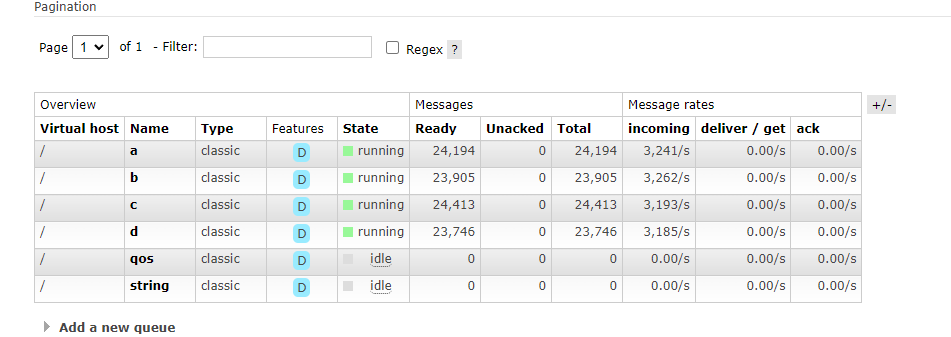
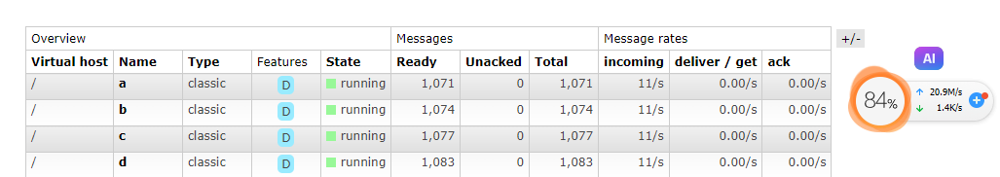
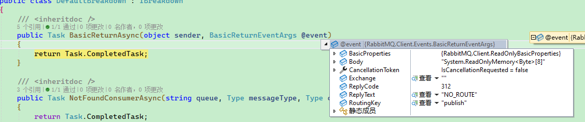
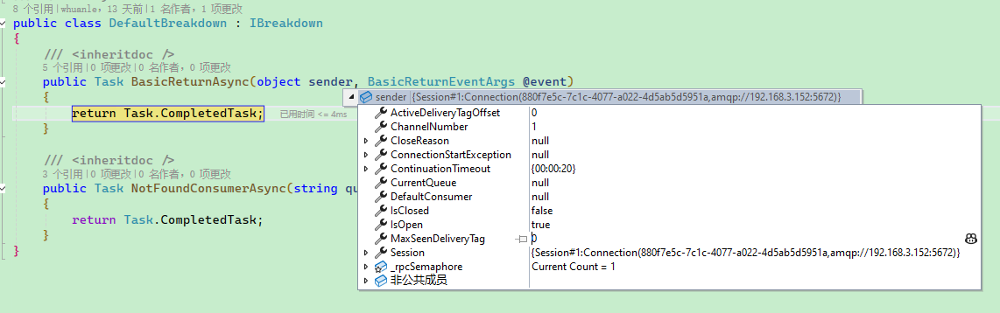

# 消息发布者

Maomi.MQ 通过 IMessagePublisher 向开发者提供消息推送服务。

消息发布者用于推送消息到 RabbitMQ 服务器中，Maomi.MQ 支持多种消息发布者模式，支持 RabbitMQ 事务模式等、数据库事务等。

<br />

在发布消息之前，需要定义一个事件模型类，用于传递消息。

```csharp
public class TestEvent
{
	public int Id { get; set; }

	public override string ToString()
	{
		return Id.ToString();
	}
}
```

<br />

然后注入 IMessagePublisher 服务，发布消息：

```csharp
private readonly IMessagePublisher _messagePublisher;

public IndexController(IMessagePublisher messagePublisher)
{
	_messagePublisher = messagePublisher;
}

[HttpGet("publish")]
public async Task<string> Publisher()
{
	for (var i = 0; i < 100; i++)
	{
		await _messagePublisher.PublishAsync(exchange: string.Empty, routingKey: "publish", message: new TestEvent
		{
			Id = i
		});
	}

	return "ok";
}
```

<br />

模型类也可以写提前设置 `[RouterKey]` 特性，这样在发送消息时不需要指定路由。

```csharp
[RouterKey("scenario.quickstart")]
public sealed class QuickStartMessage
```

```csharp
var message = new QuickStartMessage
{
	Text = request.Text,
	At = DateTimeOffset.UtcNow
};

await _publisher.AutoPublishAsync(message);
```

> 当然，即使配置了 `[RouterKey]` 特性，仍然可以手动指定推送消息到某个队列中。


### IMessagePublisher

IMessagePublisher 是 Maomi.MQ 的基础消息发布接口，Maomi.MQ 的消息发布接口就这么几个，由于直接公开了 BasicProperties ，因此开发者完全自由配置 RabbitMQ 原生的消息属性，所以接口比较简单，开发者使用接口时可以灵活一些，使用难度也不大。

<br />

BasicProperties 是 RabbitMQ 中的消息基础属性对象，直接面向开发者，可以消息的发布和消费变得灵活和丰富功能，例如，可以通过 BasicProperties 配置单条消息的过期时间：

```csharp
await _messagePublisher.PublishAsync(exchange: string.Empty, routingKey: "publish", message: new TestEvent
{
	Id = i
}, (BasicProperties p) =>
{
	p.Expiration = "1000";
});
```

<br />

Maomi.MQ 通过 DefaultMessagePublisher 类型实现了 IMessagePublisher，DefaultMessagePublisher 默认生命周期是 Scoped：

```csharp
services.AddScoped<IMessagePublisher, DefaultMessagePublisher>();
```

<br />

开发者也可以自行实现 IMessagePublisher 接口，实现自己的消息发布模型，具体示例请参考 DefaultMessagePublisher 类型。


### 原生通道

开发者可以通过 `ConnectionPool` 服务获取原生连接对象，直接在 IConnection 上使用 RabbitMQ 的接口发布消息：

```csharp
private readonly ConnectionPool _connectionPool;

var connectionObject = _connectionPool.Get();
connectionObject.DefaultChannel.BasicPublishAsync(... ...);
```


### 常驻内存连接对象

Maomi.MQ 通过 ConnectionPool 管理 RabbitMQ 连接对象，注入 ConnectionPool 服务后，通过 `.Get()` 接口获取全局默认连接实例。

<br />

如果开发者有自己的需求，也可以通过 `.Create()` 接口创建新的连接对象。

```csharp
using var newConnectionObject = _connectionPool.Create();
using var newConnection = newConnectionObject.Connection;
using var newChannel = newConnection.CreateChannelAsync();
```

> 请务必妥善使用连接对象，不要频繁创建和释放，也不要忘记了管理生命周期，否则容易导致内存泄漏。

<br />

单个 IConnectionn 即可满足大多数场景下的使用，吞吐量足够用了，笔者经过了多次长时间的测试，发现一个 IConnection 即可满足需求，多个 IConnection 并不会带来任何优势，因此去掉了旧版本的连接池，现在默认全局只会存在一个 IConnection，但是不同的消费者使用 IChannel 来隔离。

程序只维持一个 IConnection 时，四个发布者同时发布消息，每秒速度如下：



<br />

如果消息内容非常大时，单个 IConnection 也足够应付，取决于带宽。

> 每条消息 478 KiB。




### 消息过期

IMessagePublisher 对外开放了 BasicProperties，开发者可以自由配置消息属性。

例如为消息配置过期时间：

```csharp
[HttpGet("publish")]
public async Task<string> Publisher()
{
	for (var i = 0; i < 1; i++)
	{
		await _messagePublisher.PublishAsync(exchange: string.Empty, routingKey: "publish", message: new TestEvent
		{
			Id = i
		}, properties =>
		{
			properties.Expiration = "6000";
		});
	}

	return "ok";
}
```

<br />

为该消息设置过期时间后，如果队列绑定了死信队列，那么该消息长时间没有被消费时，会被移动到另一个队列，请参考 [死信队列](6.dead_queue.md)。

<br />

还可以通过配置消息属性实现更多的功能，请参考 [IBasicProperties](https://rabbitmq.github.io/rabbitmq-dotnet-client/api/RabbitMQ.Client.IBasicProperties.html) 文档。


### 事务

RabbitMQ 原生支持事务模型，RabbitMQ 的事务通讯协议可以参考 https://www.rabbitmq.com/docs/semantics

据 RabbitMQ 官方文档显示，事务模式会使吞吐量减少 250 倍，这个主要跟事务机制有关，事务模式不仅仅要保证消息已经推送到 Rabbit broker，还要保证 Rabbit broker 多节点分区同步，在 Rabbit broker 挂掉的情况下消息已被完整同步。不过一般可能用不上这么严格的模式，所以也可以使用下一小节提到的发送方确认机制。

<br />

Maomi.MQ 的事务接口使用上比较简单，可以使用扩展方法直接开启一个 ITransactionPublisher，事务接口使用上也比较简洁，示例如下：

```csharp
[HttpGet("publish_tran")]
public async Task<string> Publisher_Tran()
{
	using var tranPublisher = _messagePublisher.CreateTransaction();
	await tranPublisher.TxSelectAsync();

	try
	{
		await tranPublisher.PublishAsync(exchange: string.Empty, routingKey: "publish", message: new TestEvent
		{
			Id = 666
		});
		await Task.Delay(5000);
		await tranPublisher.TxCommitAsync();
	}
	catch
	{
		await tranPublisher.TxRollbackAsync();
		throw;
	}

	return "ok";
}
```

<br />

### 发送方确认模式

事务模式可以保证消息会被推送到 RabbitMQ 服务器中，并在个节点中已完成同步，但是由于事务模式会导致吞吐量降低 250 倍，因此  RabbitMQ 引入了一种确认机制，这种机制就像滑动窗口，能够保证消息推送到服务器中，并且具备高性能的特性，其吞吐量是事务模式 100 倍，参考资料：

https://www.rabbitmq.com/blog/2011/02/10/introducing-publisher-confirms

https://www.rabbitmq.com/docs/confirms

<br />

不过 .NET RabbitMQClient 库的新版本已经去掉了一些 API 接口，改动信息详细参考：[Issue #1682](https://github.com/rabbitmq/rabbitmq-dotnet-client/issues/1682) 、[RabbitMQ tutorial - Reliable Publishing with Publisher Confirms](https://www.rabbitmq.com/tutorials/tutorial-seven-dotnet)

<br />

Maomi.MQ 根据新版本做了简化调整，具体用法是通过创建使用独立通道的消息发布者，然后在参数中指定 IChannel 属性。

```csharp
using var confirmPublisher = _messagePublisher.CreateSingle(
	new CreateChannelOptions(publisherConfirmationsEnabled: true, publisherConfirmationTrackingEnabled: true));

for (var i = 0; i < 5; i++)
{
	await confirmPublisher.PublishAsync(exchange: string.Empty, routingKey: "publish", message: new TestEvent
	{
		Id = 666
	});
}
```

<br />

事务模式和确认机制模式发布者是相互隔离的，创建这两者对象时都会默认自动使用新的 IChannel，因此不需要担心冲突。

<br />

如果开发者有自己的需求，也可以 CreateSingle 创建独立的 IChannel，然后自定义 CreateChannelOptions 属性，关于 CreateChannelOptions 的描述，请参考：

https://rabbitmq.github.io/rabbitmq-dotnet-client/api/RabbitMQ.Client.CreateChannelOptions.html


### 强事务模式

强事务模式就是利用本地消息表，保证业务完成后，消息一定会发送成功。

例如，当用户支付订单完成后，需要发一条 MQ 消息，以便通知下游服务进行一系列处理，例如发送邮件通知、推送给物流服务、推送给审计中心等。支付逻辑自然是要做数据库事务，但是有个问题，在什么时候发送 MQ 消息？

如果在数据库事务里面加上发送 MQ 消息的代码，那么有可能消息已经发送了，但是服务挂了导致最后没有提交数据库事务，此时下游已经收到消息开始处理了，并且在数据库事务里面掺杂其它 IO 操作，可能导致数据库事务耗时延长，限制了并发能力。

如果在完成数据库事务后推送 MQ，那么有可能刚刚好在数据库事务提交后服务就挂了，下游没有收到通知，没有开始处理订单。


考虑到这种业务场景，所以 Maomi.MQ 增加了本地事务表模式，确保提交数据库事务后消息会发布成功。

根据数据库引入 nuget 包：

```
Maomi.MQ.Transaction.Mysql
Maomi.MQ.Transaction.Postgres
Maomi.MQ.Transaction.SqlServer
```


框架依赖两个表，你可以手动在数据库创建表，也可以让框架自动创建，sql 脚本文件：

 [https://github.com/whuanle/Maomi.MQ/tree/main/asserts](https://github.com/whuanle/Maomi.MQ/tree/main/asserts)

```csharp
using Maomi.MQ.Transaction.Mysql;
using MySqlConnector;

builder.Services.AddMaomiMQTransactionMySql();
builder.Services.AddMaomiMQTransaction(options =>
{
    options.ProviderName = TransactionProviderNames.MySql;
    options.Connection = _ => new MySqlConnection(builder.Configuration.GetConnectionString("Default"));
    options.AutoCreateTable = true;
});
```


发布者应在数据库内增加对 MQ 表的写入，并且在事务提交后再向 RabbitMQ 推送消息。

```csharp
public async Task ExecuteWithOutboxAsync<TMessage>(
    TMessage message,
    Func<MySqlConnection, DbTransaction, CancellationToken, Task> businessAction,
    CancellationToken cancellationToken)
    where TMessage : class
{
    await using var connection = new MySqlConnection(_connectionString);
    await connection.OpenAsync(cancellationToken);
    await using var transaction = await connection.BeginTransactionAsync(cancellationToken);

    await businessAction(connection, transaction, cancellationToken);

    var outbox = await _outboxService.RegisterAutoAsync(
        connection,
        transaction,
        message,
        cancellationToken: cancellationToken);

    await transaction.CommitAsync(cancellationToken);
    await outbox.PublishAsync(cancellationToken);
}
```


<br />

上面的代码是最小可用示例，下面补充几种在实际项目里更常见的发布者使用方式，便于按业务场景直接套用。


#### 委托模式

委托模式可以简化本地消息表的使用，自动创建事务、刷新本地消息表和发布消息。

```csharp
await ExecuteWithOutboxAsync(
    new OrderCreatedMessage { OrderNo = "SO-TX-2001", Amount = 888m },
    async (conn, tran, ct) =>
    {
        // await SaveOrderAsync(conn, tran, order, ct);
        await Task.CompletedTask;
    },
    cancellationToken);
```


#### EFCore 模式

还可以通过 IEfCoreTransactionService 注入 EFCore 服务，通过统一的上下文服务和实体，完成业务，降低了使用 ADO.NET 的复杂度。

```csharp
public sealed class OrderEfAppService
{
    private readonly IEfCoreTransactionService _efCoreTransactionService;
    private readonly AppDbContext _dbContext;

    public OrderEfAppService(IEfCoreTransactionService efCoreTransactionService, AppDbContext dbContext)
    {
        _efCoreTransactionService = efCoreTransactionService;
        _dbContext = dbContext;
    }

    public async Task CreateOrderAsync(CancellationToken cancellationToken)
    {
        var outbox = await _efCoreTransactionService.ExecuteAndRegisterAsync(
            _dbContext,
            async (db, ct) =>
            {
                db.Set<OrderEntity>().Add(new OrderEntity
                {
                    OrderNo = "SO-EF-3001",
                    Amount = 399m,
                    CreateTime = DateTimeOffset.UtcNow
                });
                await Task.CompletedTask;
            },
            exchange: "",
            routingKey: "order.created",
            message: new OrderCreatedMessage { OrderNo = "SO-EF-3001", Amount = 399m },
            cancellationToken: cancellationToken);

        await outbox.PublishAsync(cancellationToken);
    }
}
```


### 不可路由消息

当发布消息时，如果该消息不可路由，即找不对应的队列等情况，那么将会触发 `IBreakdown.BasicReturnAsync` 接口，`BasicReturnEventArgs` 属性有详细的错误原因。

<br />





<br />

对于网络故障、RabbitMQ 服务挂了、没有对应交换器名称等失败等情况，则会在当前线程上出现异常，并且 TCP 连接会自动重新连接。

需要注意 RabbitMQ 的机制，推送消息并不是同步发生的，因此即使推送失败，也不会在当前线程中出现异常，所以不能判断当前消息是否成功推送。

对于不可路由的消息，Maomi.MQ 只提供了简单的接口通知，没有其它处理机制，所以开发者需要自行处理，社区中有一款 MQ 通讯框架叫 EasyNetQ，它的默认机制是自动创建新的队列，将当前不可路由的队列推送到新的队列中，以便持久化保存。

<br />

开发者可以实现该接口，然后注册为到容器：

```csharp
services.AddScoped<IBreakdown, MyDefaultBreakdown>();
```

<br />

例如将不可路由的消息推送到新的队列中：

```csharp
public class MyDefaultBreakdown : IBreakdown
{
    private readonly ConnectionPool _connectionPool;

    public MyDefaultBreakdown(ConnectionPool connectionPool)
    {
        _connectionPool = connectionPool;
    }

    /// <inheritdoc />
    public async Task BasicReturnAsync(object sender, BasicReturnEventArgs @event)
    {
        var connectionObject = _connectionPool.Get();
        await connectionObject.DefaultChannel.BasicPublishAsync<BasicProperties>(
            @event.Exchange, 
            @event.RoutingKey + ".faild", 
            true, 
            new BasicProperties(@event.BasicProperties), 
            @event.Body);
    }

    /// <inheritdoc />
    public Task NotFoundConsumerAsync(string queue, Type messageType, Type consumerType)
    {
        return Task.CompletedTask;
    }
}
```

<br />

其实对于这种不可路由消息的情况，不单单只是转发存储，要检查是否误删队列、发布消息时队列名称是否一致等，最好在里面加上推送到飞书或钉钉群，以便在消息队列故障时及时处理问题。
