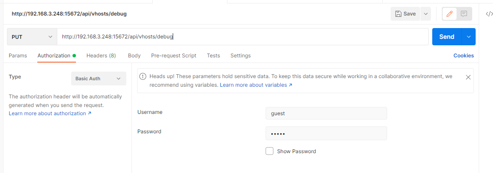
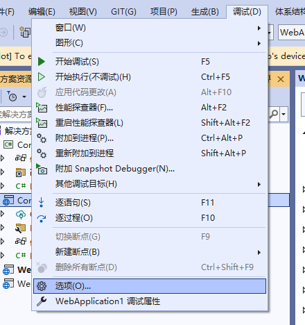
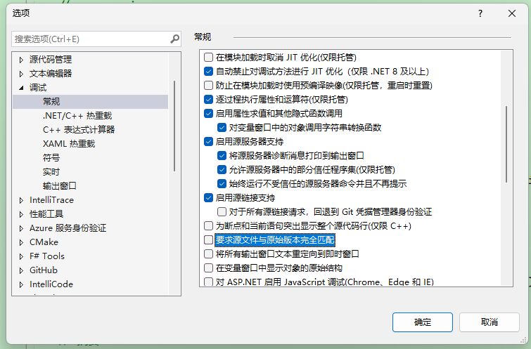
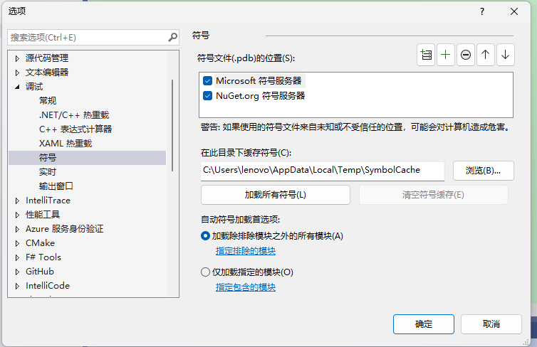
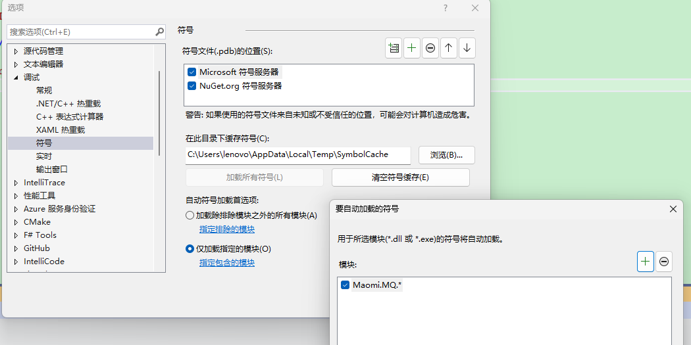
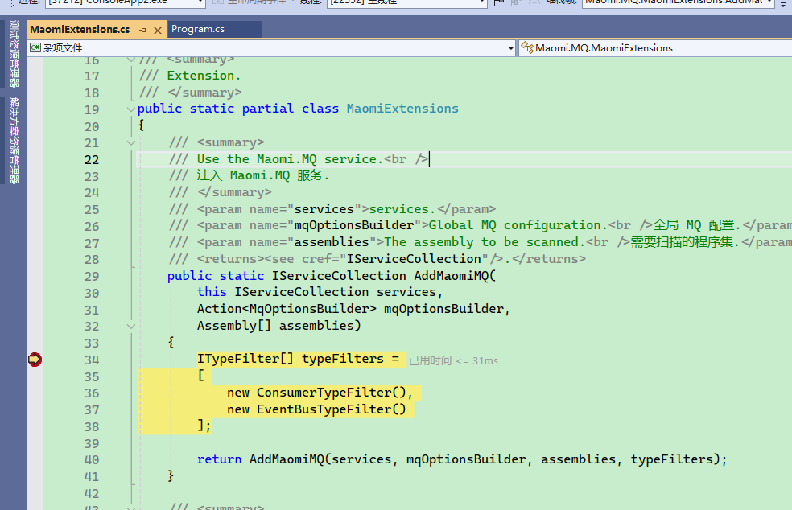
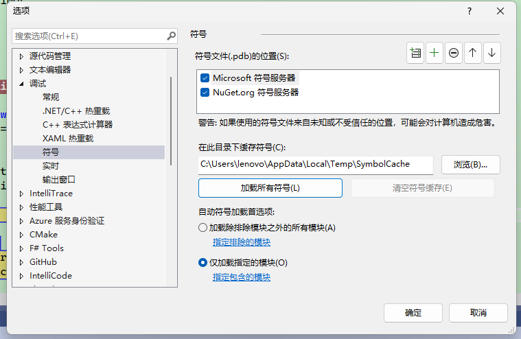

# 配置

在引入 Maomi.MQ 框架时，可以配置相关属性，示例和说明如下：

<br />

```csharp
// this.
builder.Services.AddMaomiMQ((MqOptionsBuilder options) =>
{
    // 必填，当前程序节点，用于配置分布式雪花 id，
    // 配置 WorkId 可以避免高并发情况下同一个消息的 id 重复。
	options.WorkId = 1;
    
    // 是否自动创建队列
	options.AutoQueueDeclare = true;
    
    // 当前应用名称，用于标识消息的发布者和消费者程序
	options.AppName = "myapp";
    
    // 必填，RabbitMQ 配置
	options.Rabbit = (ConnectionFactory options) =>
	{
        options.HostName = Environment.GetEnvironmentVariable("RABBITMQ")!;
        options.Port = 5672;
		options.ClientProvidedName = Assembly.GetExecutingAssembly().GetName().Name;
	};
}, [typeof(Program).Assembly]);  // 要被扫描的程序集
```

<br />

开发者可以通过 ConnectionFactory 手动管理 RabbitMQ 连接，例如故障恢复、自定义连接参数等。


### 类型过滤器

类型过滤器的接口是 ITypeFilter，作用是扫描识别类型，并将其添加为消费者，默认启用 ConsumerTypeFilter、EventBusTypeFilter 两个类型过滤器，它们会识别并使用消费者模型和事件总线消费者模式，这两种模型都要求配置对于的特性注解。

<br />

此外还有一个动态消费者过滤器 DynamicConsumerTypeFilter，可以自定义消费者模型和配置。

<br />

如果开发者需要自定义消费者模型或者接入内存事件总线例如 MediatR ，只需要实现 ITypeFilter 即可。

通过过滤器的接口，可以实现 MiedatR、FastEndpoints 等自定义外部框架接入，也可以自由实现各类消费模式。


### 拦截器

Maomi.MQ 默认启用消费者模式和事件总线模式，开发者可以自由配置是否启用。

```csharp
builder.Services.AddMaomiMQ((MqOptionsBuilder options) =>
{
	options.WorkId = 1;
	options.AutoQueueDeclare = true;
	options.AppName = "myapp";
	options.Rabbit = (ConnectionFactory options) =>
	{
        // ... ...
	};
},
[typeof(Program).Assembly], 
[new ConsumerTypeFilter(), new EventBusTypeFilter()]); // 注入消费者模式和事件总线模式
```

<br />

另外框架还提供了动态配置拦截，可以实现在程序启动时修改消费者特性的配置。

```csharp
builder.Services.AddMaomiMQ((MqOptionsBuilder options) =>
{
	options.WorkId = 1;
	options.AutoQueueDeclare = true;
	options.AppName = "myapp";
	options.Rabbit = (ConnectionFactory options) =>
	{
        // ... ...
	};
},
[typeof(Program).Assembly],
[new ConsumerTypeFilter(ConsumerInterceptor), new EventBusTypeFilter(EventInterceptor)]);
```

<br />

实现拦截器函数：

```csharp
private static RegisterQueue ConsumerInterceptor(IConsumerOptions consumerOptions, Type consumerType)
{
	var newConsumerOptions = new ConsumerOptions();
	newConsumerOptions.CopyFrom(consumerOptions);

	// 修改 newConsumerOptions 中的配置

	return new RegisterQueue(true, newConsumerOptions);
}

private static RegisterQueue EventInterceptor(IConsumerOptions consumerOptions, Type eventType)
{
	if (eventType == typeof(TestEvent))
	{
		var newConsumerOptions = new ConsumerOptions();
		newConsumerOptions.CopyFrom(consumerOptions);
		newConsumerOptions.Queue = newConsumerOptions.Queue + "_1";

		return new RegisterQueue(true, newConsumerOptions);
	}
	return new RegisterQueue(true, consumerOptions);
}
```

<br />

开发者可以在拦截器中修改配置值。

拦截器有返回值，当返回 false 时，框架会忽略注册该消费者或事件，也就是该队列不会启动消费者。


### 序列化配置

默认情况下，Maomi.MQ 会内置 `DefaultJsonMessageSerializer`，使用 `System.Text.Json` 进行消息序列化和反序列化。

如果要切换或组合其它序列化协议，不需要替换 DI 中的 `IMessageSerializer`，而是通过 `AddMaomiMQ` 的 `options.MessageSerializers` 配置序列化器列表。

```csharp
builder.Services.AddMaomiMQ((MqOptionsBuilder options) =>
{
    options.WorkId = 1;
    options.AppName = "myapp";

    options.MessageSerializers = serializers =>
    {
        // 框架默认已经包含 JSON 序列化器（DefaultJsonMessageSerializer）。
        // 在列表前面插入 Protobuf，可优先匹配 Protobuf 消息类型。
        serializers.Insert(0, new ProtobufMessageSerializer());

        // 如果你希望只使用某一种协议，也可以先清空默认列表：
        // serializers.Clear();
        // serializers.Add(new ProtobufMessageSerializer());
    };

    options.Rabbit = rabbit =>
    {
        rabbit.HostName = Environment.GetEnvironmentVariable("RABBITMQ")!;
        rabbit.Port = 5672;
    };
}, [typeof(Program).Assembly]);
```

当前 `IMessageSerializer` 只要求实现以下成员：

- `ContentType`
- `SerializerVerify<TObject>(TObject obj)`
- `SerializerVerify<TObject>()`
- `Serializer<TObject>(TObject obj)`
- `Deserialize<TObject>(ReadOnlySpan<byte> bytes)`

示例：

```csharp
public sealed class MyJsonSerializer : IMessageSerializer
{
    public string ContentType => "application/json";

    public bool SerializerVerify<TObject>(TObject obj) => true;

    public bool SerializerVerify<TObject>() => true;

    public byte[] Serializer<TObject>(TObject obj)
        => System.Text.Json.JsonSerializer.SerializeToUtf8Bytes(obj);

    public TObject? Deserialize<TObject>(ReadOnlySpan<byte> bytes)
        => System.Text.Json.JsonSerializer.Deserialize<TObject>(bytes);
}
```

`ContentType` 会写入消息头并用于消费者端选择反序列化器。跨语言或多序列化协议并存时，请确保每种序列化器使用唯一、稳定的 `ContentType`（例如 `application/json`、`application/x-protobuf`）。

如果使用 Protobuf：

- `Maomi.MQ.Message.Protobuf` 适配 `Google.Protobuf.IMessage`
- `Maomi.MQ.Message.Protobuf-net` 适配 protobuf-net（如 `[ProtoContract]`）

推荐按消息类型在 `SerializerVerify` 中做判定，实现“同一项目内多序列化器共存”。

###  消费者配置

Maomi.MQ 的消费者配置统一由 `IConsumerOptions` 表示。无论是 `[Consumer]` 特性、事件总线，还是动态消费者，最终都会落到这一组配置。

当前字段说明如下：

| 名称              | 类型             | 必填 | 默认值 | 说明 |
| ----------------- | ---------------- | ---- | ------ | ---- |
| Queue             | string           | 必填 | 无     | 队列名称（全局唯一，重复会抛异常） |
| DeadExchange      | string?          | 可选 | null   | 死信交换机名称（配合 DeadRoutingKey 生效） |
| DeadRoutingKey    | string?          | 可选 | null   | 死信路由键 |
| Expiration        | int              | 可选 | 0      | 队列过期时间（`x-expires`，单位毫秒） |
| Qos               | ushort           | 可选 | 100    | 预取数量（`BasicQos` 的 `prefetchCount`） |
| RetryFaildRequeue | bool             | 可选 | true   | 消费失败时是否 `Nack(requeue: true)` 放回原队列 |
| AutoQueueDeclare  | AutoQueueDeclare | 可选 | None   | 队列声明策略：`None` 跟随全局、`Enable` 强制声明、`Disable` 不声明 |
| BindExchange      | string?          | 可选 | null   | 需要绑定的交换机名称 |
| ExchangeType      | ExchangeType     | 可选 | Fanout | 交换机类型：`Fanout/Direct/Topic/Headers` |
| RoutingKey        | string?          | 可选 | null   | 绑定交换机时使用的路由键；为空时默认使用 `Queue` |
| IsBroadcast       | bool             | 可选 | false  | 广播模式 |

补充说明：

- `RetryFaildRequeue = true` 与 `DeadRoutingKey` 同时配置时，失败消息会优先重回原队列，死信路由不会生效。
- `AutoQueueDeclare = None` 时会继承 `AddMaomiMQ` 里的全局 `options.AutoQueueDeclare`。

可以通过类型过滤器拦截并修改消费者配置，例如统一加队列前缀：

```csharp
new ConsumerTypeFilter((consumerOptions, type) =>
{
    var newConsumerOptions = new ConsumerOptions();
    newConsumerOptions.CopyFrom(consumerOptions);

    newConsumerOptions.Queue = "app1_" + newConsumerOptions.Queue;

    // true 表示注册该消费者；false 表示忽略该消费者
    return new RegisterQueue(true, newConsumerOptions);
});
```

### IRoutingProvider：作用、用法与分配优化

`IRoutingProvider` 用来统一“路由映射”逻辑，在两个时机会被调用：

- 消费者启动时：对 `IConsumerOptions` 做最终修正（队列名、绑定交换机、路由键等）。
- 自动发布时（`AutoPublishAsync`）：对 `IRouterKeyOptions` 做最终修正（Exchange/RoutingKey）。


在编写程序代码时， `[Consumer]` 可以提前配置对应的结构，等程序运行时，你可以通过 IRoutingProvider 服务动态提供对应的最新配置，例如租户隔离，自动添加前后缀等。


注册方式：

```csharp
services.AddSingleton<IRoutingProvider, MyRoutingProvider>();
```


基础实现示例（按环境加前缀）：

```csharp
using Maomi.MQ.Consumer;

public sealed class MyRoutingProvider : IRoutingProvider
{
    private readonly string _prefix;

    public MyRoutingProvider(IHostEnvironment env)
    {
        _prefix = env.IsDevelopment() ? "dev." : "prod.";
    }

    public IConsumerOptions Get(IConsumerOptions options)
    {
        var newOptions = new ConsumerOptions();
        newOptions.CopyFrom(options);
        newOptions.Queue = _prefix + options.Queue;
        return newOptions;
    }

    public IRouterKeyOptions Get(IRouterKeyOptions options)
    {
        return new RouterKeyOptions(_prefix + options.RoutingKey, options.Exchange);
    }

    private sealed class RouterKeyOptions : IRouterKeyOptions
    {
        public RouterKeyOptions(string routingKey, string? exchange)
        {
            RoutingKey = routingKey;
            Exchange = exchange;
        }

        public string RoutingKey { get; }

        public string? Exchange { get; }
    }
}
```

上面的写法每次 `Get` 都会创建新对象。在高吞吐场景下，建议做“本地缓存 + 对象复用”，减少瞬时分配和 GC 压力。

优化思路：

- 规则是“纯函数”时（相同输入一定相同输出），可把映射结果缓存起来。
- 缓存 Key 使用稳定字段（如 `Queue|BindExchange|RoutingKey`）。
- 缓存 Value 使用只读对象；避免返回后被外部修改导致脏数据。

示例（`ConcurrentDictionary` 本地缓存）：

```csharp
using Maomi.MQ.Consumer;
using System.Collections.Concurrent;

public sealed class CachedRoutingProvider : IRoutingProvider
{
    private readonly string _prefix;
    private readonly ConcurrentDictionary<string, IConsumerOptions> _consumerCache = new();
    private readonly ConcurrentDictionary<string, IRouterKeyOptions> _publishCache = new();

    public CachedRoutingProvider(IHostEnvironment env)
    {
        _prefix = env.IsDevelopment() ? "dev." : "prod.";
    }

    public IConsumerOptions Get(IConsumerOptions options)
    {
        var key = $"{options.Queue}|{options.BindExchange}|{options.RoutingKey}|{options.ExchangeType}|{options.IsBroadcast}";
        return _consumerCache.GetOrAdd(key, _ =>
        {
            var newOptions = new ConsumerOptions();
            newOptions.CopyFrom(options);
            newOptions.Queue = _prefix + options.Queue;
            return newOptions;
        });
    }

    public IRouterKeyOptions Get(IRouterKeyOptions options)
    {
        var key = $"{options.Exchange}|{options.RoutingKey}";
        return _publishCache.GetOrAdd(key, _ =>
            new RouterKeyOptions(_prefix + options.RoutingKey, options.Exchange));
    }

    private sealed class RouterKeyOptions : IRouterKeyOptions
    {
        public RouterKeyOptions(string routingKey, string? exchange)
        {
            RoutingKey = routingKey;
            Exchange = exchange;
        }

        public string RoutingKey { get; }

        public string? Exchange { get; }
    }
}
```

注意事项：

- `IRoutingProvider` 在消费者启动和消息发布路径上都会被调用，尽量保持无阻塞、低开销。
- 若路由规则依赖会变化的配置（例如远程配置中心），请设计缓存失效策略（版本号、定时清理等）。
- 如果映射后对象还会被后续代码修改，不要直接缓存可变实例，避免并发读写问题。


### 环境隔离

<br />

在开发中，往往需要在本地调试，本地程序启动后会连接到开发服务器上，一个队列收到消息时，会向其中一个消费者推送消息。那么我本地调试时，发布一个消息后，可能本地程序收不到该消息，而是被开发环境中的程序消费掉了。

这个时候，我们希望可以将本地调试环境跟开发环境隔离开来，可以使用 RabbitMQ 提供的 VirtualHost 功能。

<br />

首先通过 put 请求 RabbitMQ 创建一个新的 VirtualHost，请参考文档：https://www.rabbitmq.com/docs/vhosts#using-http-api




<br />然后在代码中配置 VirtualHost 名称：

```csharp
builder.Services.AddMaomiMQ((MqOptionsBuilder options) =>
{
	options.WorkId = 1;
	options.AutoQueueDeclare = true;
	options.AppName = "myapp";
	options.Rabbit = (ConnectionFactory options) =>
	{
        options.HostName = Environment.GetEnvironmentVariable("RABBITMQ")!;
        options.Port = 5672;
#if DEBUG
		options.VirtualHost = "debug";
#endif
		options.ClientProvidedName = Assembly.GetExecutingAssembly().GetName().Name;
	};
}, [typeof(Program).Assembly]);
```

<br />

当本地调试时，发布和接收消息都会跟服务器环境隔离。


### 雪花 id 配置

Maomi.MQ.RabbitMQ 使用了 IdGenerator 生成雪花 id，使得每个事件在集群中都有一个唯一 id。

框架通过 IIdFactory 接口创建雪花 id，你可以通过替换 `IIdFactory` 接口配置雪花 id 生成规则。

```csharp
services.AddSingleton<IIdFactory>(new DefaultIdFactory((ushort)optionsBuilder.WorkId));
```

<br />

示例：

```csharp
public class DefaultIdFactory : IIdFactory
{
    /// <summary>
    /// Initializes a new instance of the <see cref="DefaultIdFactory"/> class.
    /// </summary>
    /// <param name="workId"></param>
    public DefaultIdFactory(ushort workId)
    {
        var options = new IdGeneratorOptions(workId) { SeqBitLength = 10 };
        YitIdHelper.SetIdGenerator(options);
    }

    /// <inheritdoc />
    public long NextId() => YitIdHelper.NextId();
}
```

<br />

IdGenerator 框架生成雪花 id 配置请参考：

https://github.com/yitter/IdGenerator/tree/master/C%23


### 调试

Maomi.MQ 框架在 nuget.org 中有符号包，需要调试 Maomi.MQ 框架时会非常方便。

<br />





<br />第一次使用时建议加载所有模块，并启动程序。



<br />

后面可以手动选择只加载那些模块。




<br />F12 到要调试的位置，启动程序后即可进入断点。



<br />

如果需要调试 Maomi.MQ.RabbtiMQ，可以在程序中加一个断点（不是在 Maomi.MQ 中），然后等待程序启动到达这个断点后，配置符号，点击加载所有符号。

然后在 Maomi.MQ.RabbitMQ 中设置断点即可进入调试。




