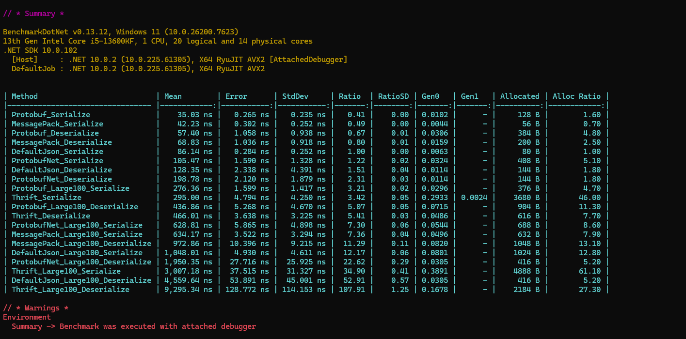

# 序列化与反序列化

在 Maomi.MQ 里，消息体最终都是 `byte[]`。序列化器的作用不是“可有可无”，它会直接影响：

- 网络包大小（带宽、RabbitMQ 存储压力）
- 发布/消费 CPU 开销
- 语言兼容性（是否容易跨语言）
- 模型演进成本（字段增删改后是否稳定）

这章不只列性能数据，还会讲清楚怎么选、怎么配、怎么避坑。

## 支持的序列化器

Maomi.MQ 当前支持 5 种：

1. `DefaultJsonMessageSerializer`（默认内置）
2. `MessagePackSerializer`
3. `ProtobufMessageSerializer`（Google.Protobuf）
4. `ProtobufMessageSerializer`（protobuf-net）
5. `ThriftMessageSerializer`

> 说明：`AddMaomiMQ()` 默认会注册 JSON 序列化器。其它序列化器需要你手动加入到 `MessageSerializers` 列表。

## 性能基准（你现在看到的表）

下面是仓库 Benchmark 的结果（小对象 + 大对象）。这份数据的价值不是“选最快”，而是让你看到不同方案的趋势：

- 二进制协议（Protobuf / MessagePack）通常比 JSON 更快、更省。
- 模型变大后，差距会进一步拉开。
- Thrift 在这份测试里分配和耗时都偏高，不适合追求极致吞吐的热点路径。

| Method                           |        Mean |      Error |     StdDev |  Ratio | RatioSD |   Gen0 |   Gen1 | Allocated | Alloc Ratio |
| -------------------------------- | ----------: | ---------: | ---------: | -----: | ------: | -----: | -----: | --------: | ----------: |
| Protobuf_Serialize               |    35.03 ns |   0.265 ns |   0.235 ns |   0.41 |    0.00 | 0.0102 |      - |     128 B |        1.60 |
| MessagePack_Serialize            |    42.23 ns |   0.302 ns |   0.252 ns |   0.49 |    0.00 | 0.0044 |      - |      56 B |        0.70 |
| Protobuf_Deserialize             |    57.40 ns |   1.058 ns |   0.938 ns |   0.67 |    0.01 | 0.0306 |      - |     384 B |        4.80 |
| MessagePack_Deserialize          |    68.83 ns |   1.036 ns |   0.918 ns |   0.80 |    0.01 | 0.0159 |      - |     200 B |        2.50 |
| DefaultJson_Serialize            |    86.14 ns |   0.284 ns |   0.252 ns |   1.00 |    0.00 | 0.0063 |      - |      80 B |        1.00 |
| ProtobufNet_Serialize            |   105.47 ns |   1.590 ns |   1.328 ns |   1.22 |    0.02 | 0.0324 |      - |     408 B |        5.10 |
| DefaultJson_Deserialize          |   128.35 ns |   2.338 ns |   4.391 ns |   1.51 |    0.04 | 0.0114 |      - |     144 B |        1.80 |
| ProtobufNet_Deserialize          |   198.78 ns |   2.120 ns |   1.879 ns |   2.31 |    0.03 | 0.0114 |      - |     144 B |        1.80 |
| Protobuf_Large100_Serialize      |   276.36 ns |   1.599 ns |   1.417 ns |   3.21 |    0.02 | 0.0296 |      - |     376 B |        4.70 |
| Thrift_Serialize                 |   295.00 ns |   4.794 ns |   4.250 ns |   3.42 |    0.05 | 0.2933 | 0.0024 |    3680 B |       46.00 |
| Protobuf_Large100_Deserialize    |   436.86 ns |   5.268 ns |   4.670 ns |   5.07 |    0.05 | 0.0715 |      - |     904 B |       11.30 |
| Thrift_Deserialize               |   466.01 ns |   3.638 ns |   3.225 ns |   5.41 |    0.03 | 0.0486 |      - |     616 B |        7.70 |
| ProtobufNet_Large100_Serialize   |   628.81 ns |   5.865 ns |   4.898 ns |   7.30 |    0.06 | 0.0544 |      - |     688 B |        8.60 |
| MessagePack_Large100_Serialize   |   634.17 ns |   3.522 ns |   3.294 ns |   7.36 |    0.04 | 0.0496 |      - |     632 B |        7.90 |
| MessagePack_Large100_Deserialize |   972.86 ns |  10.396 ns |   9.215 ns |  11.29 |    0.11 | 0.0820 |      - |    1048 B |       13.10 |
| DefaultJson_Large100_Serialize   | 1,048.01 ns |   4.930 ns |   4.611 ns |  12.17 |    0.06 | 0.0801 |      - |    1024 B |       12.80 |
| ProtobufNet_Large100_Deserialize | 1,950.35 ns |  27.716 ns |  25.925 ns |  22.62 |    0.29 | 0.0305 |      - |     416 B |        5.20 |
| Thrift_Large100_Serialize        | 3,007.18 ns |  37.515 ns |  31.327 ns |  34.90 |    0.41 | 0.3891 |      - |    4888 B |       61.10 |
| DefaultJson_Large100_Deserialize | 4,559.64 ns |  53.891 ns |  45.001 ns |  52.91 |    0.57 | 0.0305 |      - |     416 B |        5.20 |
| Thrift_Large100_Deserialize      | 9,295.34 ns | 128.772 ns | 114.153 ns | 107.91 |    1.25 | 0.1678 |      - |    2184 B |       27.30 |



## 怎么配置序列化器

默认只有 JSON。要启用其它协议，在 `AddMaomiMQ` 里把序列化器插入列表。

```csharp
builder.Services.AddMaomiMQ(
    (MqOptionsBuilder options) =>
    {
        options.WorkId = 1;
        options.AppName = "myapp";

        options.MessageSerializers = serializers =>
        {
            // 插在前面，优先匹配
            serializers.Insert(0, new ProtobufMessageSerializer());
        };

        options.Rabbit = rabbit =>
        {
            rabbit.HostName = "127.0.0.1";
            rabbit.Port = 5672;
            rabbit.UserName = "guest";
            rabbit.Password = "guest";
        };
    },
    [typeof(Program).Assembly]);
```

### 配置顺序很重要

Maomi.MQ 的选择逻辑是：

- 发布时：按 `MessageSerializers` 顺序，找到第一个 `SerializerVerify(...) == true` 的序列化器。
- 消费时：按 `MessageHeader.ContentType` 找反序列化器。

所以，序列化器的顺序和 `ContentType` 设计都会影响行为。

## 每种序列化器的模型要求

### JSON（默认）

- 不需要额外标注。
- 最容易调试（可读性高）。
- 跨语言友好。
- 体积和性能通常不如二进制协议。

适合：后台管理、低频任务、排障优先场景。

### MessagePack

模型需要 `MessagePack` 标注，例如：

```csharp
[MessagePackObject]
public sealed class OrderMessage
{
    [Key(0)] public string OrderNo { get; set; } = string.Empty;
    [Key(1)] public decimal Amount { get; set; }
}
```

特点：

- 体积小、速度快。
- C# 内部系统体验很好。
- 跨语言也可用，但团队需要统一 schema 管理。

### Google Protobuf

模型需实现 `Google.Protobuf.IMessage`（通常由 `.proto` 生成）。

特点：

- 性能和体积表现优秀。
- 跨语言生态成熟。
- 适合高并发、跨团队/跨语言接口。

### protobuf-net

模型需带 `[ProtoContract]`、`[ProtoMember(n)]`：

```csharp
[ProtoContract]
public sealed class PersonMessage
{
    [ProtoMember(1)] public Guid Id { get; set; }
    [ProtoMember(2)] public string Name { get; set; } = string.Empty;
}
```

特点：

- 对纯 C# 团队友好，上手快。
- 不强依赖 `.proto` 文件。
- 在跨语言协作时，约束性通常不如 Google Protobuf 明确。

### Thrift

模型需实现 `TBase`（通常来自 Thrift 代码生成）。

特点：

- 适合历史系统已采用 Thrift 的场景。
- 在当前 benchmark 里不是性能优选。

## 选型建议（实战）

如果你不确定怎么选，可以按下面决策：

1. 首先看团队和生态：
- 跨语言、多服务协作：优先 Google Protobuf。
- C# 内部高性能：MessagePack 或 protobuf-net。
- 兼容老系统：Thrift。

2. 再看运维和排障：
- 业务初期、经常抓包查问题：先 JSON，再逐步切二进制。

3. 最后看热点路径：
- 高频核心链路（下单、计费、风控）：用二进制协议。
- 低频链路（管理类、离线任务）：JSON 通常足够。

## 常见坑与排查

### 找不到反序列化器

报错类似：
`No suitable message serializer was found for content type 'xxx'`

排查：

- 发布端写入的 `ContentType` 与消费端是否都注册了对应序列化器。
- 服务 A、B 的 `MessageSerializers` 配置是否一致。

### 模型不符合序列化器要求

例如：

- MessagePack 模型没加 `[MessagePackObject]`
- protobuf-net 模型没加 `[ProtoContract]`
- Google Protobuf 不是 `.proto` 生成的 `IMessage`

这类错误通常会在发布或消费时抛 `ArgumentException`。

### 同一 ContentType 冲突

`Google Protobuf` 和 `protobuf-net` 默认都使用 `application/x-protobuf`。

如果你同时注册两者，需要注意：

- 消费端按 `ContentType` 选序列化器时，同一 `ContentType` 只会保留一个（按注册顺序取第一个）。
- 最好在一个服务内固定只用一种 protobuf 方案，或自定义不同 `ContentType` 的序列化器实现。

### 发布端和消费端版本不一致

模型字段变更后，旧消费者可能读不到字段或语义变化。

建议：

- 优先“追加字段”，避免复用字段号。
- 升级时做灰度，发布端和消费端版本错开验证。

## 如何自定义序列化器

实现 `IMessageSerializer` 即可：

```csharp
public class MySerializer : IMessageSerializer
{
    public string ContentType => "application/x-mycodec";

    public bool SerializerVerify<TObject>(TObject obj) => obj is MyMessage;
    public bool SerializerVerify<TObject>() => typeof(TObject) == typeof(MyMessage);

    public byte[] Serializer<TObject>(TObject obj)
    {
        // encode
        throw new NotImplementedException();
    }

    public TObject? Deserialize<TObject>(ReadOnlySpan<byte> bytes)
    {
        // decode
        throw new NotImplementedException();
    }
}
```

然后在 `AddMaomiMQ` 里加入：

```csharp
options.MessageSerializers = serializers => serializers.Insert(0, new MySerializer());
```

## 一句话建议

- 想省心：先 JSON。
- 想性能：优先 Google Protobuf / MessagePack。
- 想稳定演进：把 schema 管理当成“接口契约”来治理，而不是仅仅当作序列化细节。


